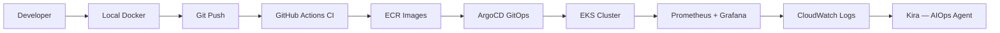
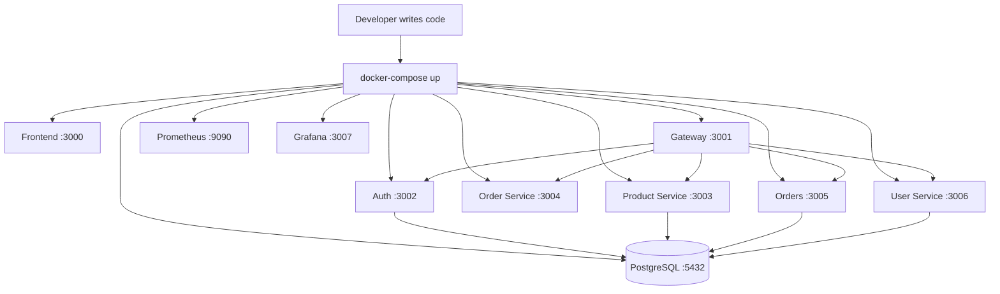
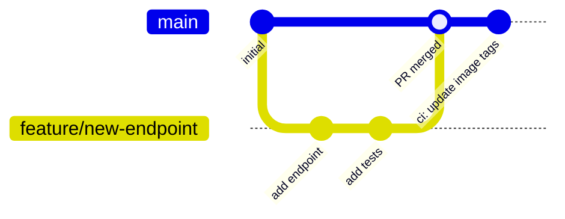
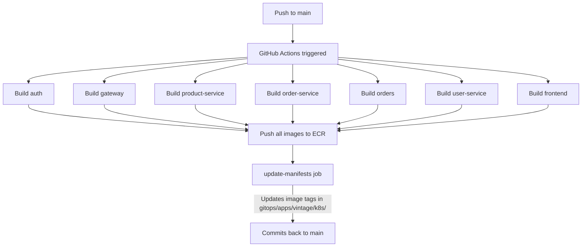
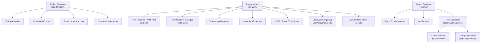
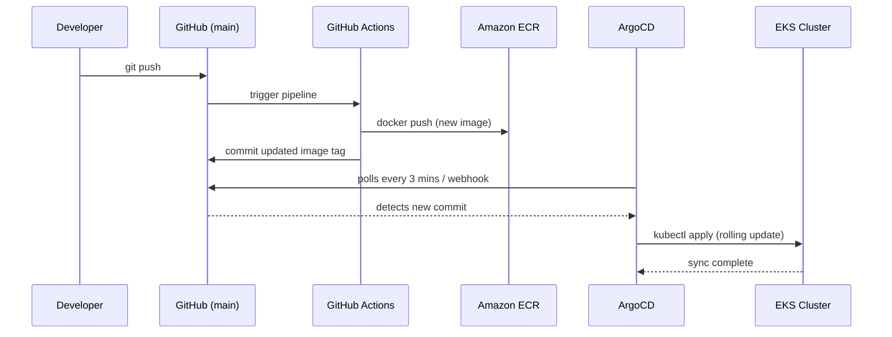
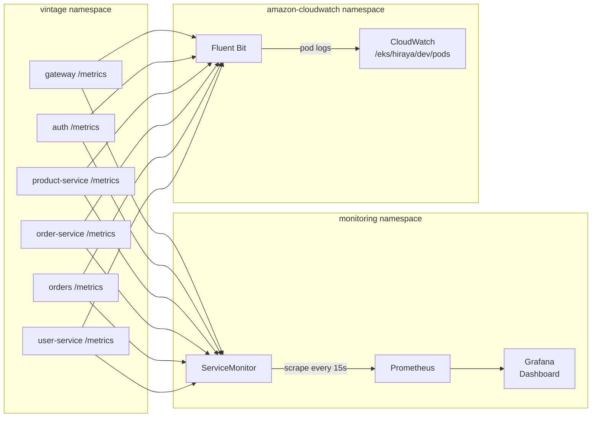
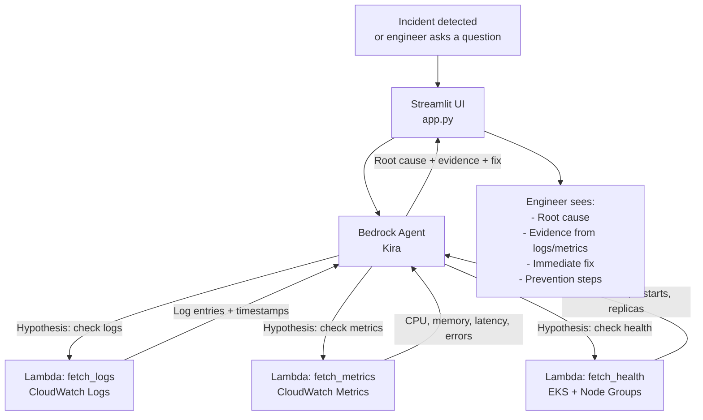
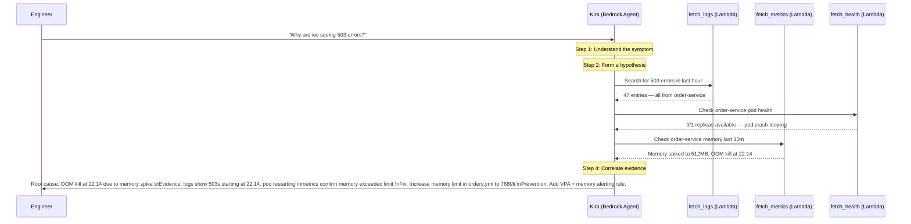
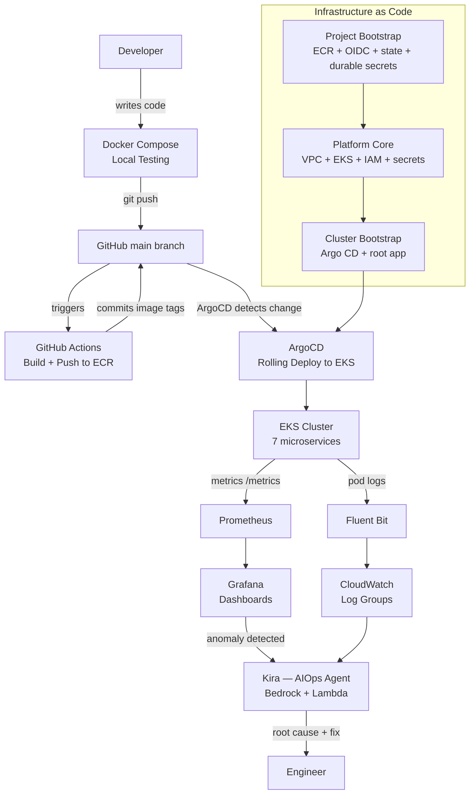

# Onboard

## Architecture Overview

```
                                    ┌─────────────┐
                                    │   Frontend  │
                                    │ (Port 3000) │
                                    └──────┬──────┘
                                           │
                                    ┌──────▼──────┐
                                    │   Gateway   │
                                    │ (Port 3001) │
                                    └──────┬──────┘
                                           │
            ┌──────────────────────────────┼──────────────────────────────┐
            │                              │                              │
     ┌──────▼──────┐              ┌────────▼──────┐             ┌────────▼──────┐
     │    Auth     │              │Product Service│             │  User Service │
     │ (Port 3002) │              │  (Port 3003)  │             │  (Port 3006)  │
     └──────┬──────┘              └───────┬───────┘             └───────┬───────┘
            │                             │
     ┌──────▼──────┐              ┌───────▼───────┐
     │Order Service│              │    Orders     │
     │ (Port 3004) │              │  (Port 3005)  │
     └──────┬──────┘              └───────────────┘
            │
     ┌──────▼──────┐
     │  PostgreSQL │
     │ (Port 5432) │
     └─────────────┘

┌──────────────────────────────────────────────────┐
│                 Monitoring Stack                 │
│   Prometheus (9090) ◄──── Grafana (8080)         │
└──────────────────────────────────────────────────┘
```

| Service | Port | Role |
|---------|------|------|
| Frontend | 3000 | React UI |
| Gateway | 3001 | Routes all client requests to backend services |
| Auth | 3002 | Login and registration |
| Product Service | 3003 | Product catalog and inventory |
| Order Service | 3004 | Cart and checkout |
| Orders | 3005 | Order history and management |
| User Service | 3006 | User profiles and account management |
| PostgreSQL | 5432 | Stores auth_db, products_db, orders_db, users_db |
| Prometheus | 9090 | Metrics collection |
| Grafana | 8080 | Metrics dashboards |

## Kubernetes and GitOps structure

Hiraya dev follows the ADR-0007 layered ownership model. For deeper implementation detail, read [GitOps refactor PRD #93](https://github.com/noidilin/hiraya/issues/93), [docs/plan/gitops-refactor-implementation.md](plan/gitops-refactor-implementation.md), and [docs/plan/gitops-refactor-checklist.md](plan/gitops-refactor-checklist.md).

```
infra/envs/dev/bootstrap/          # Project Bootstrap: durable state access, OIDC roles, ECR, app secrets
infra/envs/dev/platform-core/      # Platform Core: AWS/EKS foundation only; no Kubernetes or Helm providers
infra/envs/dev/cluster-bootstrap/  # Cluster Bootstrap: Argo CD install and root GitOps handoff

gitops/
├── clusters/dev/root/             # root app-of-apps child Application manifests
├── platform/                      # Cluster Platform: CRDs, controllers, edge, logging, monitoring, admin routes
└── apps/vintage/                  # Vintage Storefront workload manifests
    ├── external-secret.yml        # maps AWS Secrets Manager secret into the runtime Kubernetes Secret
    └── k8s/
        ├── backend/               # One Deployment + Service per backend service
        ├── frontend/              # Frontend Deployment + Service + HTTPRoute
        ├── database/              # PostgreSQL StatefulSet, Service, restore Job
        └── grafana-dashboard.yml  # Pre-loaded Grafana dashboard (ConfigMap)
```

Project Bootstrap is durable. Platform Core and Cluster Bootstrap are disposable. Argo CD owns Cluster Platform and GitOps Apps desired state after Cluster Bootstrap installs the root Application.

## GitHub Action Pipeline jobs

```
push to main
     │
     ▼
build-and-push (7 parallel jobs)
  └── For each service: docker build → docker push to ECR
     │
     ▼
update-manifests
  └── Updates image tags in gitops/apps/vintage/k8s/
  └── Commits back to main
```

## How services expose metrics to Prometheus

Each backend service exposes a `/metrics` endpoint (Node.js `prom-client`). A `ServiceMonitor` resource tells Prometheus where to scrape:

```yaml
# gitops/apps/vintage/k8s/backend/service-monitor.yml
spec:
  namespaceSelector:
    matchNames:
      - vintage
  selector:
    matchLabels:
      app: gateway
  endpoints:
    - port: http
      path: /metrics
      interval: 15s
```

The `ServiceMonitor` has the label `release: kube-prometheus-stack` which is how the Prometheus Operator discovers it automatically.

## How the dashboard is pre-loaded in Grafana

The dashboard lives in `gitops/apps/vintage/k8s/grafana-dashboard.yml` as a `ConfigMap`. It has the label:

```yaml
labels:
  grafana_dashboard: "1"
```

The `kube-prometheus-stack` Helm chart includes a **Grafana sidecar** that watches for ConfigMaps with this label across all namespaces. When it finds one, it automatically imports the JSON dashboard into Grafana — no manual import needed.

### Grafana Pre-loaded Dashboard

The **Vintage Microservices** dashboard includes:

| Panel | What it shows |
|-------|--------------|
| Request Rate — $service | HTTP requests/sec broken down by status code |
| Response Time — $service | p95 and p99 latency |
| Active Requests | In-flight requests at any moment |
| Error Rate | 5xx rate as a percentage of total traffic |
| Request Rate by Service | All services on one graph |
| Node.js Heap Memory | Used vs total heap per service |
| Node.js Event Loop Lag | Latency in the JS event loop (indicator of CPU pressure) |
| Pod CPU Usage | CPU per pod in the vintage namespace |
| Pod Memory Usage | Memory per pod |
| Pod Restart Count | Surfaces crash-looping pods |
| Service Health | UP/DOWN status per service |
| HTTP Error Rate by Service | 4xx and 5xx breakdown per service |

The dashboard has a **Service** dropdown variable at the top — use it to filter all panels to a specific service.

---

## Flow



---

### Stage 1: Local Development

Every change starts on a developer's machine. The full application stack runs locally using Docker Compose — no cloud account required.



Each service has its own `Dockerfile`. Docker Compose wires them together with a shared network, letting you test the full system locally before touching any cloud infrastructure.

---

### Stage 2: Source Control

Once a change is tested locally, it goes into Git.



**The flow:**

1. Developer creates a feature branch
2. Makes changes, commits with clear messages
3. Opens a Pull Request on GitHub
4. PR is reviewed and merged into `main`
5. Merge to `main` triggers the CI pipeline automatically

Everything is tracked — who changed what, when, and why. This is the foundation of GitOps.

---

### Stage 3: CI Pipeline — GitHub Actions

On every push to `main`, GitHub Actions builds Docker images for all 7 services in parallel and pushes them to Amazon ECR.



**Key concepts:**

- Each service is a separate matrix job — they all build in parallel
- Images are tagged with the commit SHA for full traceability
- The `update-manifests` job patches the image tag in every Kubernetes manifest and commits the change back
- This commit is what ArgoCD detects to trigger a rollout

**Where to check:** GitHub repo → **Actions** tab → **Vintage CI Pipeline**

---

### Stage 4: Infrastructure — Terraform and GitOps on AWS

Before the cluster can run anything, the layered dev platform must exist.



Project Bootstrap is applied manually/local from `main`. The deploy workflow applies Platform Core first, then Cluster Bootstrap. Platform Core owns only AWS/EKS-side foundation resources and must not use Kubernetes or Helm providers. Cluster Bootstrap installs Argo CD and the root app-of-apps. Argo CD then reconciles Cluster Platform add-ons and the Vintage Storefront from Git.

---

### Stage 5: GitOps Deployment — ArgoCD

ArgoCD runs inside the cluster and watches the `main` branch. The moment the CI pipeline commits updated image tags back to Git, ArgoCD detects the change and rolls out the new version.



**What ArgoCD does:**

- Continuously compares the desired state in Git against the live state in the cluster
- If they differ, it syncs — applying only what changed
- If someone manually changes something in the cluster, ArgoCD reverts it to match Git
- Every deployment is auditable — it's just a Git commit

**Key files:**

- `gitops/clusters/dev/root/` — root app-of-apps child Applications for Cluster Platform and workloads
- `gitops/platform/` — Argo CD-owned Cluster Platform resources such as Gateway API CRDs, AWS Load Balancer Controller, ExternalDNS, External Secrets Operator, edge, logging, monitoring, and Argo CD access
- `gitops/apps/vintage/kustomization.yml` — lists Vintage Storefront resources, including the dev database restore Job
- `gitops/apps/vintage/k8s/` — Vintage service deployments, services, HTTPRoute, and reset-on-rebuild database resources
- `gitops/apps/vintage/external-secret.yml` — maps the durable AWS Secrets Manager Vintage secret into the runtime Kubernetes Secret through ESO

---

### Stage 6: Observability

Once the application is running in EKS, three layers of observability keep watch.



**Metrics — Prometheus + Grafana**

- Every service exposes a `/metrics` endpoint using `prom-client`
- A `ServiceMonitor` resource tells the Prometheus Operator which pods to scrape
- Grafana is pre-loaded with a vintage dashboard via a ConfigMap labelled `grafana_dashboard: "1"` — the Grafana sidecar auto-imports it

**Logs — Fluent Bit + CloudWatch**

- Fluent Bit runs as a DaemonSet in `amazon-cloudwatch`
- Captures stdout from every pod and ships logs to CloudWatch
- Log group: `/eks/hiraya/dev/pods`

**What to check in Grafana:**

- Request rate by service
- p95 / p99 response times
- 4xx and 5xx error rates
- Pod CPU and memory usage
- Pod restart count — surfaces crash loops early

---

### Stage 7: AIOps — Kira (Bedrock Agent)

This is where the workflow goes beyond traditional DevOps. When something goes wrong in production, instead of manually digging through logs and metrics, you ask Kira.



Kira's deployed query surface is CloudWatch Logs and CloudWatch Metrics. ADOT is deferred in the current GitOps migration; when it is implemented, Platform Core owns AWS/IAM/CloudWatch-side resources and Argo CD-owned Cluster Platform manifests own the in-cluster collector.

**How Kira investigates:**



**The Kira workflow:**

1. Engineer describes a symptom
2. Kira forms a hypothesis
3. Gathers evidence using the 3 Lambda tools (logs, metrics, health)
4. Correlates data across all three sources
5. Returns root cause, supporting evidence, immediate fix, and prevention steps

**Kira never guesses.** Every conclusion is backed by specific log entries or metric values.

---

## The Complete Picture


